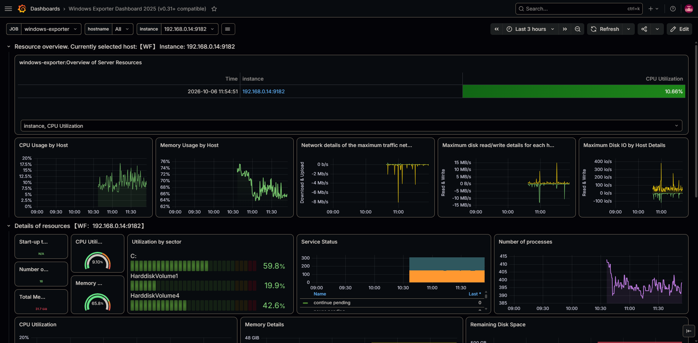
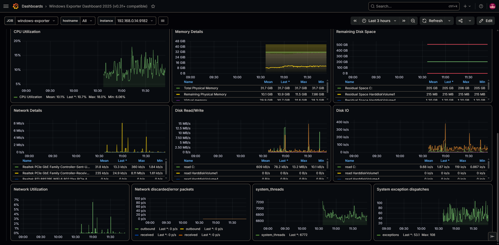

# Monitoring Stack


A containerized monitoring solution using **Prometheus**, **Grafana**, **Node Exporter**, and **Windows Exporter** to collect, store, and visualize host-level system metrics.
> Designed to set up full observability in minutes. The Linux/WSL side is fully automated; the Windows side requires a one-time native install of `windows_exporter`.

## Visualizations






If you want to see images on full size, go to [screenshots](screenshots) folder.

## Overview

This project spins up a full observability stack via Docker Compose. **Node Exporter** scrapes hardware and OS metrics from the Linux/WSL host, while **Windows Exporter** — installed natively on the Windows host — does the same on the Windows side. Prometheus collects and stores both, and Grafana provides pre-provisioned dashboards to visualize them. All containerized services run on an isolated Docker network.

## Architecture

```bash
┌───────────────────────────────────────────────────────────┐
│                  Docker Network: monitoring               │
│                                                           │
│  ┌───────────────┐    scrape     ┌──────────────┐         │
│  │ node-exporter │ ◄──────────── │  prometheus  │         │
│  │   :9100       │   /metrics    │    :9090     │         │
│  └───────────────┘               └──────┬───────┘         │
│        │                                │                 │
│   host /proc                       datasource             │
│   host /sys                             │                 │
│   host /                    ┌───────────▼──────────┐      │
│                             │       grafana        │      │
│                             │        :3000         │      │
│                             └──────────────────────┘      │
└───────────────────────────────────────────────────────────┘
              ▲
              │ scrape /metrics
              │
      ┌───────┴────────────┐
      │  Windows Host      │
      │  windows_exporter  │
      │      :9182         │
      │  (native MSI)      │
      └────────────────────┘
```

## Deployed Resources

| Resource | Type | Image | Port | Description |
| --- | --- | --- | --- | --- |
| `node-exporter` | Docker container | `prom/node-exporter:latest` | `9100` | Collects host hardware and OS metrics |
| `windows-exporter` | Native Windows service (external) | `prom/windows-exporter:latest` | `9182` | Collects Windows host metrics using native MSI |
| `prometheus` | Docker container | `prom/prometheus:latest` | `9090` | Scrapes and stores time-series metrics |
| `grafana` | Docker container | `grafana/grafana:latest` | `3000` | Visualizes metrics via dashboards |
| `prometheus_data` | Docker volume | — | — | Persists Prometheus TSDB data |
| `grafana_data` | Docker volume | — | — | Persists Grafana configuration and state |
| `monitoring` | Bridge network | — | — | Isolated network for inter-service communication |

## Requirements

**For the Linux/WSL side:**

- Docker
- Docker Compose v2

**For the Windows side (optional, only if you want to monitor a Windows host):**

- See [Windows Host Prerequisites](#windows-host-prerequisites) below.

## Windows Host Prerequisites

- Install `windows_exporter` (MSI): <https://github.com/prometheus-community/windows_exporter/releases>
- Allow TCP 9182 port in Windows Firewall (PowerShell as admin):

  ```powershell
  New-NetFirewallRule -DisplayName "Windows Exporter" -Direction Inbound -Protocol TCP -LocalPort 9182 -Action Allow
  ```

- Verify response: <http://localhost:9182/metrics>
- Adjust the host IP in `prometheus/prometheus.yml` (job `windows-exporter`)

## Getting Started

```bash
git clone git@github.com:wilhen199/monitoring-stack.git && cd monitoring-stack
docker compose up -d
```

Open <http://localhost:3000>

| Service | URL |
| --- | --- |
| Grafana | <http://localhost:3000> |
| Prometheus | <http://localhost:9090> |
| Node Exporter | <http://localhost:9100/metrics> |
| Windows Exporter | `http://<windows-host-ip>:9182/metrics` |

Default Grafana credentials: `admin / admin`
> Change these credentials on first login. If you lost the password, run:
> `docker exec -it grafana grafana cli admin reset-admin-password <new>`

## Dashboards

This project ships with two community dashboards, both provisioned automatically on startup:

- [Node Exporter Full (ID 1860)](https://grafana.com/grafana/dashboards/1860) — comprehensive Linux/WSL host metrics.
- [Windows Exporter (ID 23942)](https://grafana.com/grafana/dashboards/23942) — comprehensive Windows host metrics.

The JSON files were downloaded directly from the Grafana dashboard registry and placed in `grafana/dashboards/` so they get provisioned automatically — no manual import needed

```bash
# Create the dashboard directory if it doesn't exist and download the JSON
mkdir -p grafana/dashboards
curl -o grafana/dashboards/node-exporter-full.json "https://grafana.com/api/dashboards/1860/revisions/latest/download"
curl -o grafana/dashboards/windows-exporter.json "https://grafana.com/api/dashboards/23942/revisions/latest/download"
```

> **Note on the Windows dashboard:** the JSON downloaded from grafana.com uses the
> `${DS_PROMETHEUS}` variable, which is only resolved when importing manually through
> the UI. Since this project provisions dashboards via files, replace the variable with
> your datasource UID before starting Grafana:
>
> ```powershell
> (Get-Content .\grafana\dashboards\windows-exporter.json -Raw) `
>   -replace '\$\{DS_PROMETHEUS\}', 'prometheus' |
>   Set-Content .\grafana\dashboards\windows-exporter.json -NoNewline -Encoding utf8
> ```
>
> Linux/macOS equivalent:
>
> ```bash
> sed -i 's/\${DS_PROMETHEUS}/prometheus/g' grafana/dashboards/windows-exporter.json
> ```
>
> Make sure your Prometheus datasource is provisioned with `uid: prometheus` in
> `grafana/provisioning/datasources/prometheus.yml`.

## Troubleshooting

- **Target shows `DOWN` in `http://localhost:9090/targets`**
  Check the Windows Firewall rule and verify that the IP in `prometheus/prometheus.yml` is the one **WSL sees** for the Windows host — not `localhost` and not the Windows-internal IP.
- **Grafana panels are empty with `Datasource ${DS_PROMETHEUS} was not found`**
  The Windows dashboard JSON still contains the `${DS_PROMETHEUS}` placeholder. See the note in the [Dashboards](#dashboards) section.
- **Grafana login fails with `admin / admin`**
  The password was changed previously and persisted in the `grafana_data` volume. Reset it with:
  `docker exec -it grafana grafana cli admin reset-admin-password admin`

## Best Practices Covered

- **Health checks** — `node-exporter` and `prometheus` expose health endpoints; dependent services wait for `service_healthy` before starting, preventing race conditions on startup.
- **Startup ordering** — `depends_on` with health conditions ensures `prometheus` only starts after `node-exporter` is ready, and `grafana` only starts after `prometheus` is healthy.
- **Restart policy** — All services use `restart: unless-stopped` to recover automatically from crashes without restarting on intentional stops.
- **Persistent volumes** — Named volumes (`prometheus_data`, `grafana_data`) ensure metrics and dashboard configurations survive container restarts or recreations.
- **Read-only host mounts** — Host directories (`/proc`, `/sys`, `/`) are mounted as `:ro` in Node Exporter, minimizing the attack surface.
- **Network isolation** — All services communicate over a dedicated `bridge` network (`monitoring`), keeping them isolated from other containers on the host.
- **Infrastructure as Code** — Grafana datasources and dashboards are fully provisioned via config files, making the setup reproducible and version-controlled with no manual UI steps.
- **Filesystem exclusions** — Node Exporter excludes virtual/system mount points (`/proc`, `/sys`, `/dev`, etc.) to avoid noisy or irrelevant filesystem metrics.
