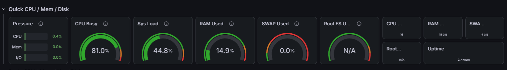
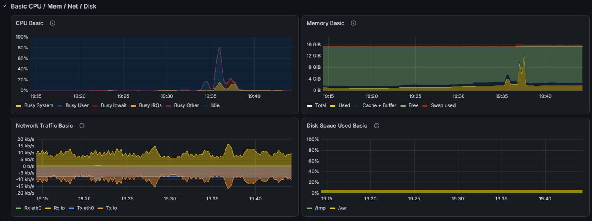

# Monitoring Stack


A containerized monitoring solution using **Prometheus**, **Grafana**, and **Node Exporter** to collect, store, and visualize host-level system metrics.
> Designed to set up full observability for a host in minutes, without any manual configuration.

## Visualizations





If you want to see images on full size, go to [screenshots](screenshots) folder.

## Overview

This project spins up a full observability stack via Docker Compose. Node Exporter scrapes hardware and OS metrics from the host machine, Prometheus collects and stores those metrics, and Grafana provides a pre-provisioned dashboard to visualize them — all wired together in an isolated Docker network.


## Architecture

```
┌─────────────────────────────────────────────────────┐
│                   Docker Network: monitoring         │
│                                                      │
│  ┌───────────────┐     scrape      ┌──────────────┐ │
│  │ node-exporter │ ◄────────────── │  prometheus  │ │
│  │   :9100       │  /metrics       │    :9090     │ │
│  └───────────────┘                 └──────┬───────┘ │
│        │                                  │         │
│   host /proc                         datasource     │
│   host /sys                               │         │
│   host /                          ┌───────▼──────┐  │
│                                   │   grafana    │  │
│                                   │    :3000     │  │
│                                   └──────────────┘  │
└─────────────────────────────────────────────────────┘
```

## Deployed Resources

| Resource | Image | Port | Description |
|---|---|---|---|
| `node-exporter` | `prom/node-exporter:latest` | `9100` | Collects host hardware and OS metrics |
| `prometheus` | `prom/prometheus:latest` | `9090` | Scrapes and stores time-series metrics |
| `grafana` | `grafana/grafana:latest` | `3000` | Visualizes metrics via dashboards |
| `prometheus_data` | Docker volume | — | Persists Prometheus TSDB data |
| `grafana_data` | Docker volume | — | Persists Grafana configuration and state |
| `monitoring` | Bridge network | — | Isolated network for inter-service communication |

## Requirements

- Docker
- Docker Compose v2

## Getting Started

```bash
git clone git@github.com:wilhen199/monitoring-stack.git && cd monitoring-stack
docker compose up -d
```
Open http://localhost:3000


| Service | URL |
|---|---|
| Grafana | http://localhost:3000 |
| Prometheus | http://localhost:9090 |
| Node Exporter | http://localhost:9100/metrics |

Default Grafana credentials: `admin / admin`

## Dashboard

The Grafana dashboard used in this project is [Node Exporter Full (ID 1860)](https://grafana.com/grafana/dashboards/1860), a community dashboard that provides comprehensive host-level metrics visualization. The JSON file was downloaded directly from the Grafana dashboard registry and placed in `grafana/dashboards/` so it gets provisioned automatically on startup — no manual import needed.

```bash
# Create the dashboard directory if it doesn't exist and download the JSON
mkdir -p grafana/dashboards
curl -o grafana/dashboards/node-exporter-full.json "https://grafana.com/api/dashboards/1860/revisions/latest/download"
```

## Best Practices Covered

- **Health checks** — `node-exporter` and `prometheus` expose health endpoints; dependent services wait for `service_healthy` before starting, preventing race conditions on startup.
- **Startup ordering** — `depends_on` with health conditions ensures `prometheus` only starts after `node-exporter` is ready, and `grafana` only starts after `prometheus` is healthy.
- **Restart policy** — All services use `restart: unless-stopped` to recover automatically from crashes without restarting on intentional stops.
- **Persistent volumes** — Named volumes (`prometheus_data`, `grafana_data`) ensure metrics and dashboard configurations survive container restarts or recreations.
- **Read-only host mounts** — Host directories (`/proc`, `/sys`, `/`) are mounted as `:ro` in Node Exporter, minimizing the attack surface.
- **Network isolation** — All services communicate over a dedicated `bridge` network (`monitoring`), keeping them isolated from other containers on the host.
- **Infrastructure as Code** — Grafana datasources and dashboards are fully provisioned via config files, making the setup reproducible and version-controlled with no manual UI steps.
- **Filesystem exclusions** — Node Exporter excludes virtual/system mount points (`/proc`, `/sys`, `/dev`, etc.) to avoid noisy or irrelevant filesystem metrics.
